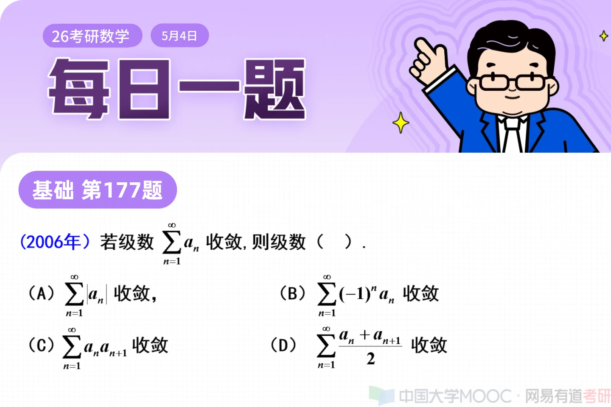
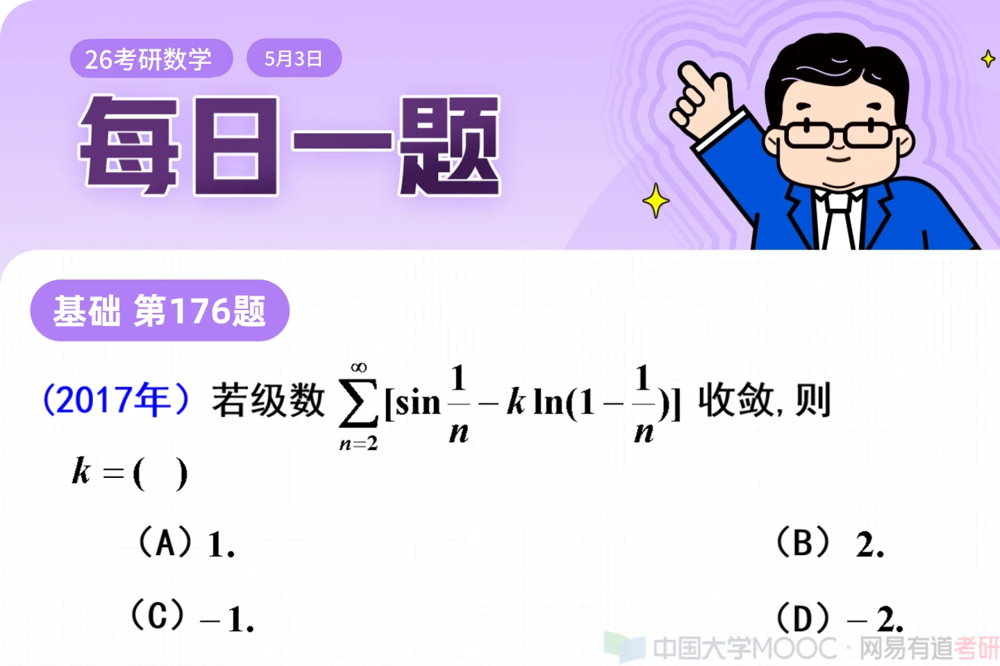
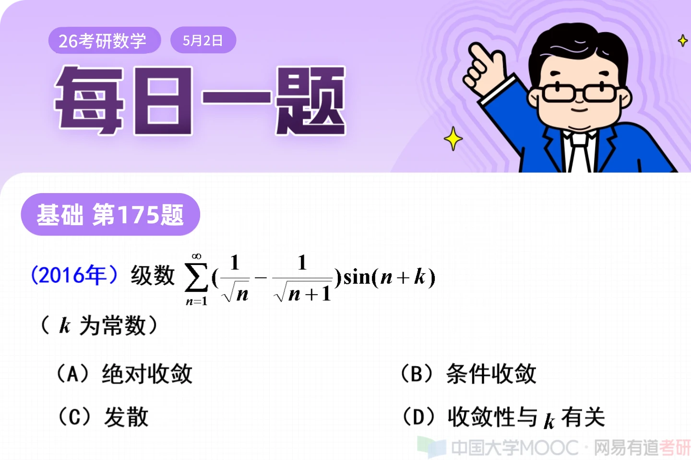
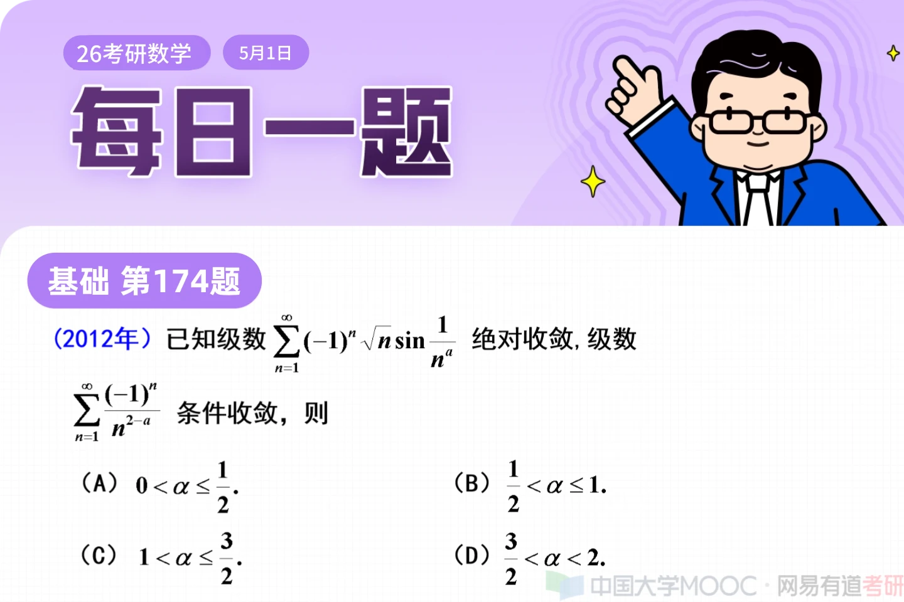
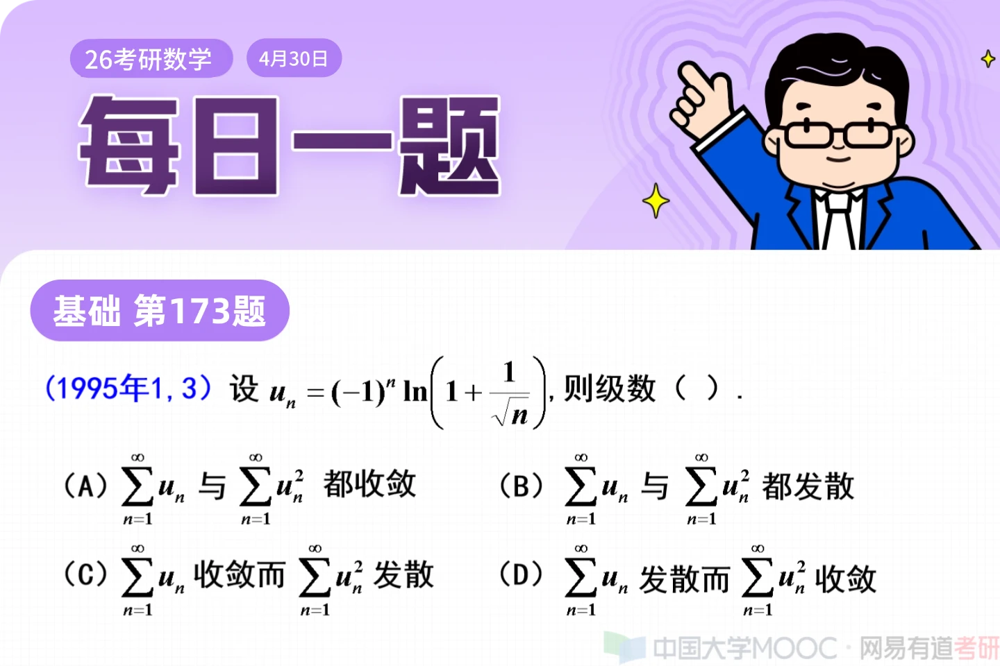
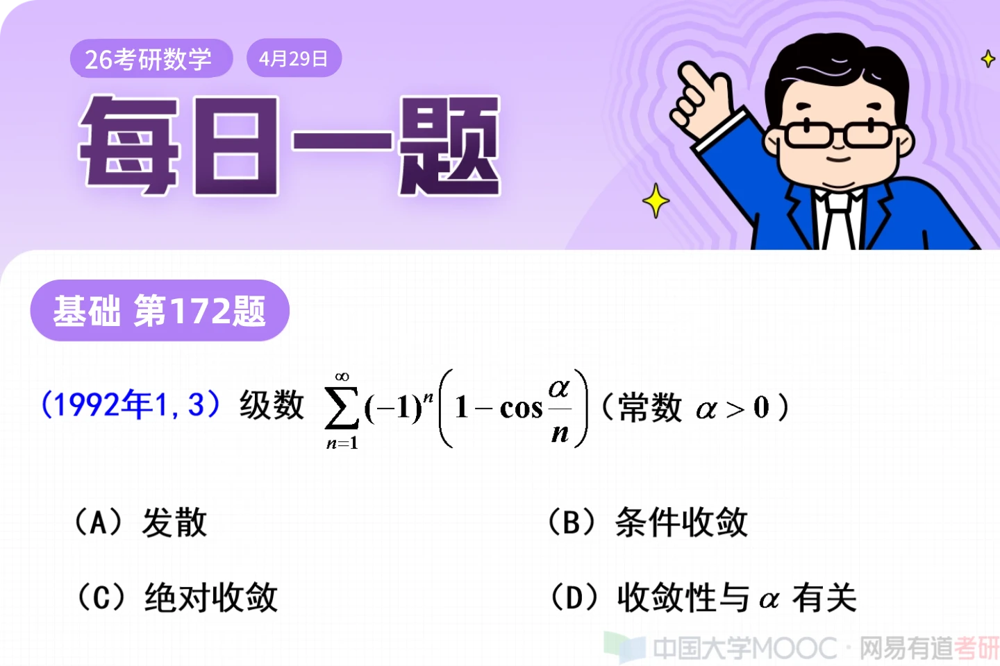

<!-- ID: 1063282721844887552 -->
## 每日一题 | 第 178 题 (2025-05-05 08:00)

**文本:**

26考研每日一题｜第178题 

想冲高分的同学，这道题需要举出错误反例！

今天的题目数二同学不做要求，数二的同学可以去看之前的每日一讲

**图片:**

---

<!-- ID: 1062911636647444497 -->
## 每日一题 | 第 177 题 (2025-05-04 08:00)

**文本:**

26考研每日一题｜第177题 

今天这四个选项的例子都要整理到笔记本上！

今天的题目数二同学不做要求

数二的同学可以巩固之前的每日一题或者做其他练习题

打卡的题目不限，但是要坚持做题

**图片:**

---

<!-- ID: 1062540551444758549 -->
## 每日一题 | 第 176 题 (2025-05-03 08:00)

**文本:**

26考研每日一题｜第176题 

这道题的细节很多，同学们要认真体会！

今天的题目数二同学不做要求

数二的同学可以巩固之前的每日一题或者做其他练习题

打卡的题目不限，但是要坚持做题

**图片:**

---

<!-- ID: 1062169466294501393 -->
## 每日一题 | 第 175 题 (2025-05-02 08:00)

**文本:**

26考研每日一题｜第175题

遇到绝对收敛和条件收敛，最先看什么？

今天的题目数二同学不做要求

数二的同学可以巩固之前的每日一题或者做其他练习题

打卡的题目不限，但是要坚持做题

**图片:**

---

<!-- ID: 1061798381111738370 -->
## 每日一题 | 第 174 题 (2025-05-01 08:00)

**文本:**

26考研每日一题｜第174题

还记得正项级数三巨头吗？

今天的题目数二同学不做要求

数二的同学可以巩固之前的每日一题或者做其他练习题

打卡的题目不限，但是要坚持做题

**图片:**

---

<!-- ID: 1061427295954141191 -->
## 每日一题 | 第 173 题 (2025-04-30 08:00)

**文本:**

26考研每日一题｜第173题

今天的题目数二同学不做要求

数二的同学可以巩固之前的每日一题或者做其他练习题

打卡的题目不限，但是要坚持做题

**图片:**

---

<!-- ID: 1061056210747260928 -->
## 每日一题 | 第 172 题 (2025-04-29 08:00)

**文本:**

26考研每日一题｜第172题 

表面上考级数，实则考...

今天的题目数二同学不做要求

数二的同学可以巩固之前的每日一题或者做其他练习题

打卡的题目不限，但是要坚持做题

往期每日一题合集：https://www.bilibili.com/video/BV14A4m1L7u1/?spm_id_from=333.999.0.0

**图片:**

---

